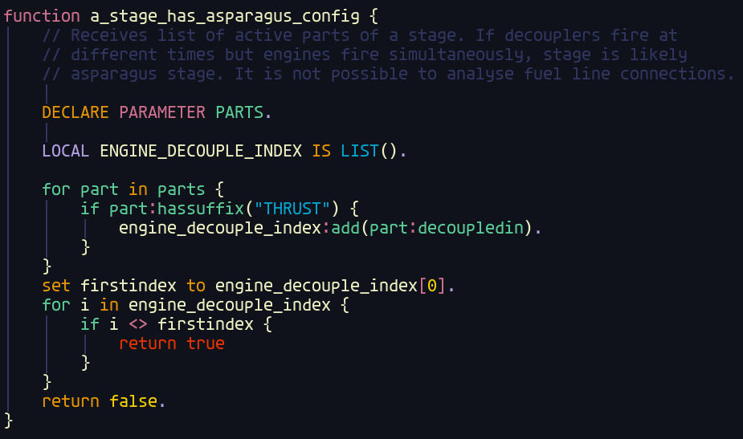

# kerboscript.nvim
Defines kerboscript language tokens for vim syntax highlighting

Preview color theme: `pineapplegiant/spaceduck` https://github.com/pineapplegiant/spaceduck

* Also includes a list of all suffixes which are assigned colors for very basic error checking.
  * (Won't recognize error if type does not have that suffix, i.e. in "PRINT:ADD", ADD will be assigned a color even though print is not a structure) 
* Line is marked as erroneous if it does not end properly (i.e. no "." at line end)
* Case insensitive
